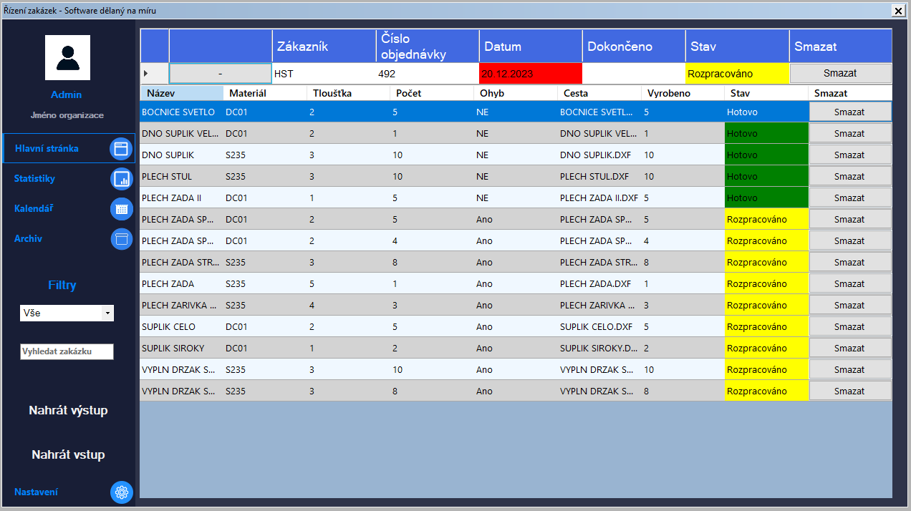
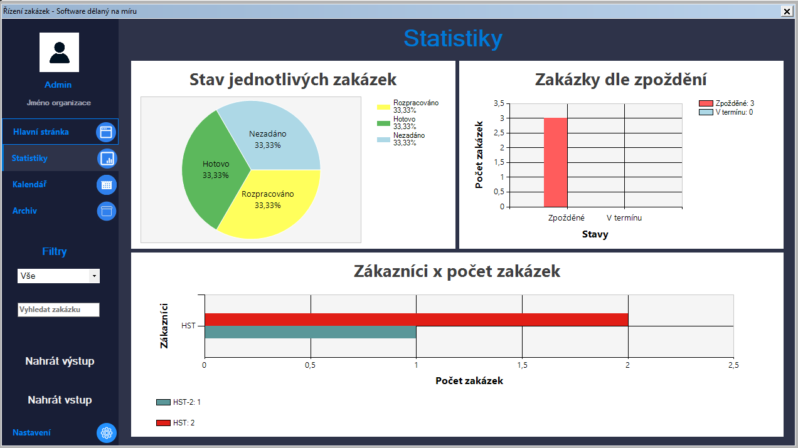
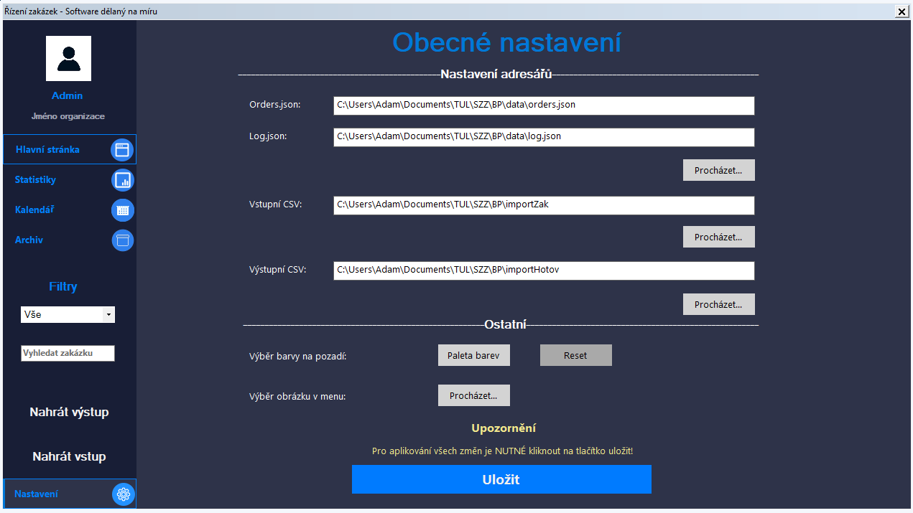

# Projekt 

Vítejte v mém bakalářském projektu! Tento README Vám poskytne přehled o projektu, včetně toho, co projekt obsahuje, jak ho spustit a testovat, a jaké jsou testovací data.

## Obsah

1. [Popis projektu](#popis-projektu)
2. [Instalace](#instalace)
3. [Spouštění](#spouštění)
4. [Testování](#testování)
5. [Testovací data](#testovací-data)
6. [Manuál a dokumentace](#manual-a-dokumentace)
7. [Příspěvky a zpětná vazba](#příspěvky-a-zpětná-vazba)
8. [Autoři](#autoři)
9. [Obrázky](#obrázky)

## Popis projektu

Tento projekt vytváří desktopovou aplikaci, která řeší vyhodnocování (stav dokončení) zakázek dle dokončení jednotlivých položek zakázky.
Aplikace tak uživatelům umožňuje spravovat nahrané zakázky, editovat či smazat data a celkově tak poskytuje ucelený přehled stavu jednotlivých zakázek, jež jsou v podinku aktuální.
Poslední implementace zajišťuje i možnost generování statistik, které uživatelé mohou využít pro další analýzu a vyhodnocování aktuálních zakázek. V neposlední řadě byla též implementována možnost archivace.
Byl využit jazyk C# s využitím platformy .NET Framework a knihovny Windows Forms pro vytvoření UI.
Výsledná aplikace je tak určena pro vybraný podnik, pro který byla navržena, vytvořena, přizpůsobena a taky otestována. 

### Klíčové funkce
- Přehledný a uživatelsky přívětivý design
- Jednoduché a intuitivní ovládání
- Synchronní zobrazení aktuálních zakázek napříč všemi zařízeními v podniku
- Dvě prostředí pro uživatele (administrátor a běžný uživatel)
- Správa aktuálních zakázek a jejich položek (stav dokončení)
- Editace a smazání údajů o zakázkách či položkách
- Generování statistik (grafy)
- Archivace hotových zakázek po půl roce od jejího dokončení
- Uživatelské nastavení a možnost přizpůsobení vzhledu
- Responzivní aplikace pro menší i větší rozlišení

## Potřebné moduly pro spuštění aplikace
- .NET 6.0
- .NET Desktop Runtime 6.0

## Instalace

Pro spuštění projektu stačí stáhnout instalační balíček ve složce Versions (formát ZIP) a rozbalit jej na svém počítači. Aplikaci pak stačí naintsalovat spolu s potřebnými balíčky pro spuštění aplikace (měl by zajišťovat instalační balíček - viz dokumentace).
Po úspěšné instalaci lze aplikaci spustit skrze vytvořeného zástupce na ploše či Vaše prostředí.

## Spouštění

Projekt lze spustit buď z vývojového prostředí nebo sestavením a spuštěním výsledného .exe souboru. Při spuštění aplikace se zobrazí hlavní okno, kde uživatelé nejdříve musí nastavit potřebné cesty pro zajištění správně funkcionaity aplikace. Pro uložení změn v nastavení je třeba znát heslo. 
Pro tento účel je třeba kontaktovat vývojáře na jeho email. Pro zajištění správného prvotního nastavení a komplexního používání celé aplikace je nejdříve doporučeno řádně nastudovat dokumentaci a dodržovat přesný postup.
Manuál (čili dokumentaci) lze nalézt ve složce Manual.

## Testování

Pro testování aplikace je nutné mít nainstalované testovací prostředí pro platformu .NET, jako je NUnit. Testy lze spustit pouze z vývojového prostředí.

## Testovací data

Pro účely testování jsou k dispozici originální testovací data od organizace, která jsou nutná použít k ověření funkcionality aplikace. Testovací data jsou k dispozici ve formě souborů s příponou .CSV a lze je nalézt v adresáři Data. 
Nejdříve je nutné nahrát všechny vstupní soubory a až poté všechny výstupní soubory.

## Manuál a dokumentace

Pro správné používání aplikace je nutné se řídit manuálem, který je k dispozici ve složce Manual. Manuál obsahuje kompletní popis všech funkcí aplikace, včetně postupů pro správné nastavení a používání aplikace.
## Příspěvky a zpětná vazba

Pokud máte nějaké nápady na vylepšení aplikace nebo narazíte na chyby, budu rád za vaše příspěvky a zpětnou vazbu. Pro příspěvky můžete použít vytvoření příspěvku v kategorii Issues v mém repozitáři.

## Autor a Kontakt

Tento projekt byl vytvořen v rámci bakalářské práce, jehož autorem je Adam Sucharda.
Email: asucharda@seznam.cz

## Obrázky

